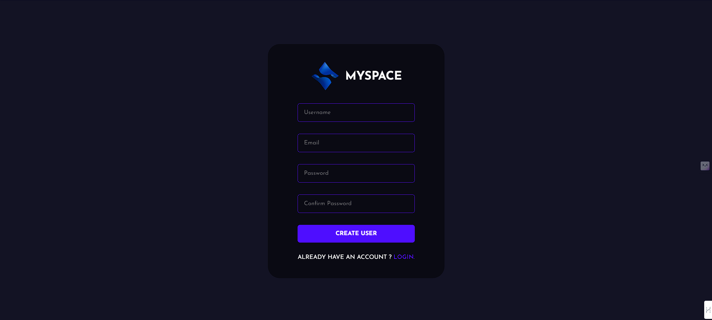
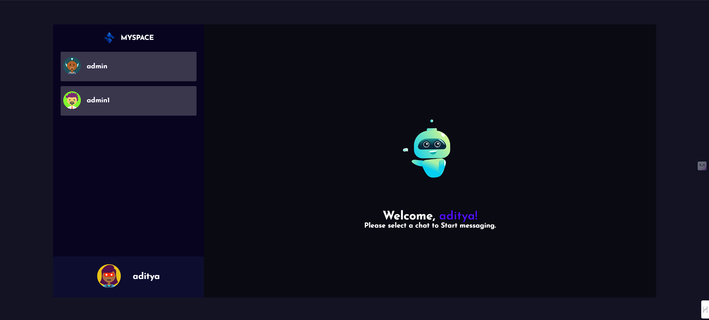

# Snappy - Chat Application 
Snappy is a chat application built with the power of MERN Stack.






## Installation Guide

### Requirements
- [Nodejs](https://nodejs.org/en/download)
- [Mongodb](https://www.mongodb.com/docs/manual/administration/install-community/)

Both should be installed and make sure mongodb is running.

For Frontend.
```shell
cd public
npm start
```
For Backend.

Open another terminal in folder, Also make sure mongodb is running in background.
```shell
cd server
npm start
```
Done! Now open localhost:3000 in your browser.
